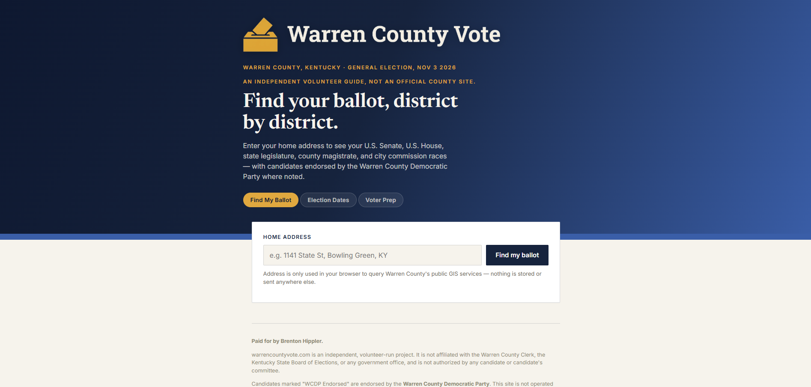
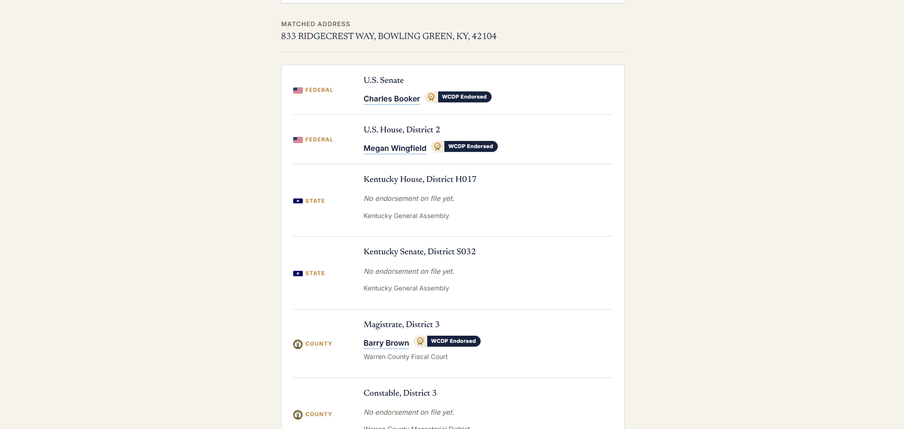
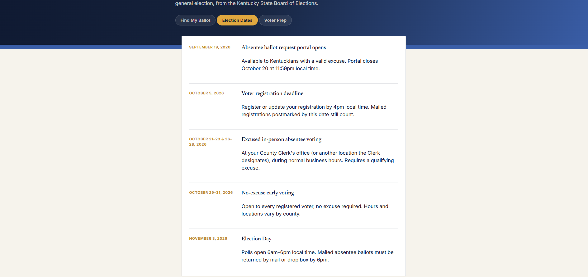

# Warren County Ballot Guide

A lookup tool for Warren County, Kentucky voters. Enter a home address and see every race on your ballot, from U.S. Senate down to county magistrate and Bowling Green City Commission, along with the Warren County Democratic Party's endorsements where they're on file.

**[Live site →](https://warrencountyvote.com)**

## The problem

Most voters don't know which magistrate, city commission, or state legislative district they live in, so down-ballot races are easy to overlook. District lines can also change between elections, so a static list goes out of date.

## My contribution

Sole developer. This is an independent, volunteer-run project.

- Address lookup that matches a voter to their federal, state, county, and city districts
- A results view listing each race, with the endorsed candidate or a clear "no endorsement on file" state
- Election Dates and Voter Prep tabs covering deadlines, voting windows, ID requirements, and a voter hotline
- A content setup that lets non-developers update endorsements and dates each election cycle

## Tech stack

React, Vite, public ArcGIS REST services (Warren County, City of Bowling Green, and Commonwealth of Kentucky GIS)

## Screenshots





## Technical decisions

### Live public GIS data instead of hand-built address lists
The app geocodes the address with the county's 911 address locator, then checks which district boundary contains that point in each official GIS layer. Results stay accurate when districts are redrawn, with no manual data entry.

### Parallel district queries
Once an address is geocoded, the lookups for magistrate, city limits, KY House, KY Senate, and other boundaries all run at the same time with `Promise.all` instead of one after another. The total wait is only as long as the slowest query.

### No backend and no stored addresses
Every lookup runs in the voter's browser, directly against public GIS services. There's no server to maintain, and the app never stores anyone's address.

### Content in plain data files
Endorsements, election dates, and voter prep content live in three small files (`src/data.js`, `src/electionDates.js`, `src/voterPrep.js`). Updating the guide for a new election means editing those files, not the app's code.

## Accessibility and testing

- Labeled form input for the address search
- Races grouped by level (federal, state, county, city) with icons and text labels, so meaning never relies on the icon alone
- Lookups tested against addresses inside and outside Bowling Green city limits and across different magistrate and legislative districts
- **No automated test suite yet.** 

## Setup

```bash
git clone https://github.com/brenthippler-art/warren-county-ballot-guide.git
cd warren-county-ballot-guide
npm install
npm run dev
```

`npm run build` creates a production build in `dist/`, and `npm run preview` serves it locally.

### Updating content for a new election

- **Endorsements:** edit `src/data.js`. State House and Senate picks are keyed by district number, magistrates by magistrate district, and City Commission is a list since those seats are at-large. Each pick can include an optional campaign `url`.
- **Dates and voter prep:** edit `src/electionDates.js` and `src/voterPrep.js`. Both are sourced from the Kentucky State Board of Elections and should be re-checked every cycle.
- **GIS services:** if a county or state service moves, update its URL constant in `src/lib/gis.js`.

## Live link

[warrencountyvote.com](https://warrencountyvote.com)

## Author

**Brenton Hippler:** [Portfolio](https://brentoncodes.dev) · [LinkedIn](https://www.linkedin.com/in/brenton-hippler-818b6397) · [GitHub](https://github.com/brenthippler-art)